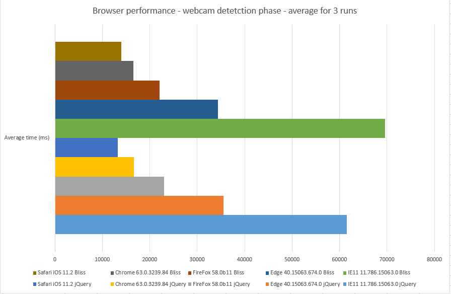

# veiblikk

Route planning web application with webcam images along the route.
A prototype was built on [#hack4no 2017](http://www.hack4.no/).

- [Application Overview - in norwegian](http://folk.ntnu.no/sverrsti/GEO2311-H2017/webapplikasjon-eksempel.html)
- [Presenting prototype at #hack4no](https://www.flickr.com/photos/statenskartverk/38011135581/in/album-72157688079862294/)

## Contributors

- [Sverre Stikbakke](https://github.com/sverres)
- [Vegard Stikbakke](https://github.com/vegarsti)

## API's and javascript librarys

- [Statens vegvesen routing service](https://data.norge.no/data/statens-vegvesen/api-ruteplantjeneste-bil)
- [Statens vegvesen webcam service](https://data.norge.no/data/statens-vegvesen/trafikkinformasjon-p%C3%A5-datex-format)
- [Kartverket address service](https://www.kartverket.no/data/stedsnavnsok/)
- [Geonorge WMTS tiles](https://kartkatalog.geonorge.no/metadata/uuid/758607fa-45d2-41b1-b8fe-fc7a2c5bcd8d)
- [Mapbox GL JS](https://www.mapbox.com/mapbox-gl-js/api/)
- [Turf - for spatial analysis](http://turfjs.org/)
- [Proj4js - to transform coordinates](http://proj4js.org/)
- [jQuery](https://jquery.com/)

## Live version

- [https://sverres.net/veiblikk](https://sverres.net/veiblikk/)

## Browser performance

- Lenovo Thinkpad X1 Yoga - Intel Core i7-7500 2.7/2.9 GHz
- iPhone X

Route: Strandkaien 1, Stavanger - Storgata 1, Kirkenes (2670 km)

Wall time for webcam module calculations (with no external dependencies - only in-browser calculations). Polyfills are included for IE11.

Browser |Veiblikk version |1. run |2. run |3. run |Average time (ms)
-- |-- |-- |-- |-- |--
IE11 11.786.15063.0 |jQuery |61511 |61867 |61092 |61490
| |Bliss |165870 |162123 |159337 |162443
Edge 40.15063.674.0 |jQuery |38490 |34236 |33953 |35560
| |Bliss |37309 |32896 |32768 |32768  |34324
FireFox 58.0b11 |jQuery |22876 |23432 |22831 |23046
| |Bliss |21997 |22231 |21943 |22057
Chrome 63.0.3239.84 |jQuery |16799 |16673 |16596 |16689
| |Bliss |16466 |16312 |16808 |16529
Safari iOS 11.2 |jQuery |13298 |13198 |13399 |13298
| |Bliss |13944 |13998 |13958 |13967

